= Applications de marches auto-évitantes et des équations differentielles dans l'étude des polymères et de l'épidémiologie
Oxana USHAKOVA
:feelpp: Feel++
:stem: latexmath
:toc:

== Introduction

Cette recherche concerne l'étude des processus aléatoires et contient deux parties :  marches auto-évitantes (dans le contexte du synthèse des polymères) et EDO stochastiques (dans le contexte de l'épidémiologie).

La science macromoléculaire est étroitement liée avec la chimie, la biochimie, la pharmacologie, etc. Le développement industriel de ces domaines explique la motivation de cette étude. 

== Chapitre 1 : Marches auto-évitantes et les polymères

Un polymères est une marcomolécule constitueé des la répétition des nombreuses monomères à liason covalente. Une chaîne contient typiquement stem:[10^3-10^5] monomères, et a la longeur de stem:[10^{-5} - 10^{-2}] cm. La forme géometrique est aussi importante que les propriétes chimiques.

=== Concept mathématique

On appele une SAW ("Self-avoiding walk") une marche des points toutes distincts dans une lattice à dimension stem:[d]. Ce modèle a été créé spécialement pour simuler des polymères linéaires dans un dissolvant il y 50 ans.

Sous la condition que la distance entre les points voisins est constante, on a stem:[2d] pas possibles à chaque étape. Si de plus on suppose, que la marche ne peut pas revenir en arrière, on a stem:[2d-1] pas possible à chaque étape sauf le premier (stem:[2d]).

La fonction de partition qui donne l'information su l'efficacité des marches générées de longeur stem:[N] peut être écrite comme :

* fonction de partition

stem:[ <Z(N)>_{ss}=\frac{nb-marches-acceptée}{nb-des-simulations}]

* fonction de partition pour les marches "poindérés"

stem:[ Z_{bs}=\frac{\sum_{toutes-les-marches}W_{marche}}{nb des simulations}=<W>]

Pour les méthodes statiques, la fonction de partition est de la forme:

stem:[Z_N=C exp (-\lambda N)N^{\gamma-1}] avec

* stem:[C] - constante de normalisation
* stem:[\lambda] - attrition constant
* stem:[\gamma] - critical exponent (ne dépend pas du modèle)

=== Algorithmes

Les algorithmes statiques se basent sur les chaînes de Markov, autrement dit l'itération stem:[n] ne dépend que de stem:[n-1]. Les algorithmes dynamiques se basent sur SAW, autrement dit l'itération stem:[n] ne dépend pas de stem:[\sum_0^{n-1}]. 

==== Algorithmes statiques: Simple Sampling

. Se mettre à l'origine du polymère
. Générer le premier pas aléatoirement/Choisir le premier pas arbitrairement
. Choisir aléatoirement un des stem:[2d-1] pas
. Si la marche générée s'intersecte, on la rejète et commence dès le début - étape 1
. Si la marche générée nous convient, on rajoute ce pas dans la marche
. Si la marche générée est de longeur souhaitée,on accepte la marche. Sinon, on revient vers étape 3.
. Répéter jusqu'à la marche soit de la longeur souhaitée.

===== _Avantages_
* Facile à programmer
* Pas de bias : toutes configurations sont possibles

===== _Disavantages_
* Pas efficace pour des chaînes longues dans petites dimensions car la taux du rejet devient trop élévé.

==== Algorithmes statiques: Biased Sampling (Méthode de Rosenbluth)
. Se mettre à l'origine du polymère
. Générer le premier pas aléatoirement/Choisir le premier pas arbitrairement
. Trouver tous les pas qui ne donne pas l'intersection
. Si il n'y a pas de tels pas - on met le poids stem:[\omega=0], on rejète la marche générée et on revient vers le début - étape 2. Sinon on ajoute ce pas à la marche et recalculont le poids stem:[\omega].
. Si la marche générée est de longeur souhaitée, on accepte la marche et on calcule le poids total. Sinon, on revient vers étape 3.
. Répéter jusqu'à la marche soit de la longeur souhaitée

===== _Avantages_
* Pas difficile à programmer
* Beaucoup plus efficace que l'algorithme précedent
* Pas de bias : toutes configurations sont possibles

===== _Disavantages_
* Pas efficace pour des chaînes trop longues dans petites dimensions car la taux du rejet devient trop élévé.

==== Algorithmes dynamiques: Algorithme de Reptation 

. Générer ou chisir un SAW à n pas
. Choisir une fin aléatoirement et la retirer
. Choisir aléatoirement un des stem:[2d-1] pas possibles de l'autre côté
. Si ce pas donne l'intersection, on revient à l'arrière et considère  cette configuration comme nouvelle
. Si ce pas ne donne pas de l'intersection,   on considère cette configuration comme nouvelle
. On revient à l'étape 2 jusqu'à on a la longeur  souhaitée de la marche

===== _Avantages_
* Très efficace
* Chaque itération ne demande que un peu de calcul
 
===== _Disavantages_
* Pas intuitive
* Le résultat dépend de l'origine, de la condition initiale
* Bias : il y a des configuration qu'on ne peut jamais obtenir

==== Algorithmes dynamiques: Algorithme de pivot

. Générer ou chisir un SAW à n pas
. Choisir aléatoirement un pivot sur la marche. Ce pivot divise la marche en deux
. Choisir aléatoirement une des deux sous-marches
. Choisir aléatoirement un opération symétrique et l'appliquer à la sous-marche
. Si cette opération donne l'intersection, on revient à l'arrière et considère  cette configuration comme nouvelle
. Si cette opération ne donne pas de l'intersection,   on considère cette configuration comme nouvelle
. On revient à l'étape 2 jusqu'à on a la longeur  souhaitée de la marche

===== _Avantages_
* Converge vite
* Pas de bias : toutes configurations sont possibles 

===== _Disavantages_
* Chaque itération demande beaucoup de calcul
* Difficile à implémenter à l'ordinateur : nombres des symétries augement très vite
* Pas trop efficace pour des chaînes longues, mais converge toujours aussi vite 

=== Autre application : Vulcanisation 

Vulcanisation est un procédé chimique consistant à incorporer un agent vulcanisant (soufre) à un polymère pour former des ponts entre les chaînes molèculaires après la cuisson. Cette opération est largement utiliser dans le domaine de la production des pneu, car le polymère vulcanisé devient plus élastique et solide, moins plastique et moins dissoluble en dissolvants organiques.

Considèrons un 2-méthylbuta-1,3-diène polymérisé, autrement dit le caoutchouc naturel. Si on rajoute du soufre, après cuisson, on obtient un nouveau matériau qu'on utilise quotidiennement aujourd'hui. A l'echelle moléculaire on voit un réseau des monomères liés entre eux directement (comme le polymère d'avant) et par les molécules d'agent vulcanisant.

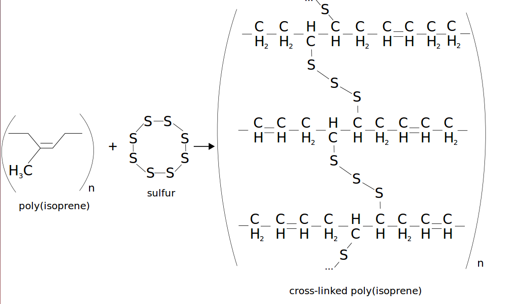

Voici un exemple avec le caoutchouc synthétique buta-1,3-diène polymérisé. 

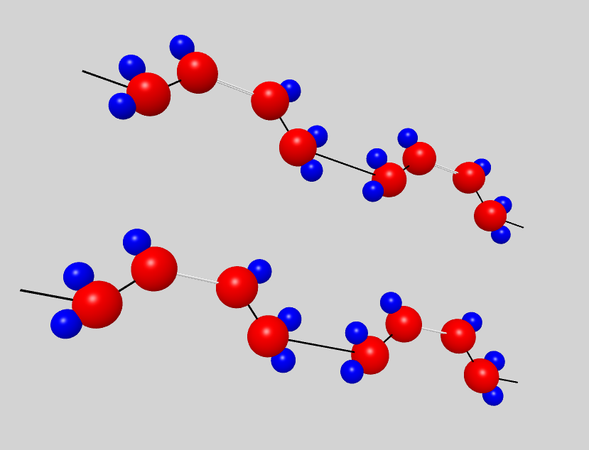

On rajoute du soufre: 

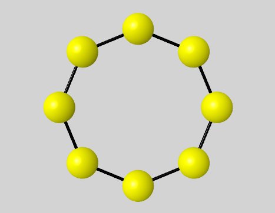

Et après "la cuisson" on obtient le réseau des monomères liés entre eux en polymères et liés aux monomères des macromolécules voisines par les ponts du soufre. La longeur du pont, càd le nombre des atomes du soufre, varie aléatoirement de 1 à 8:
 
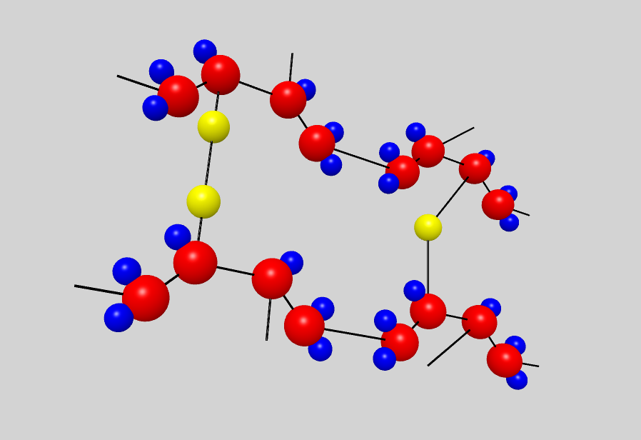
 

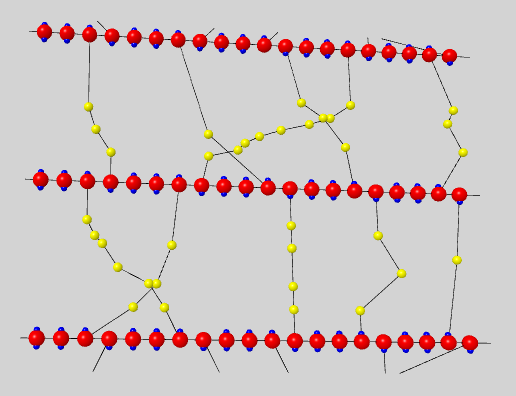

Le soufre n'affect pas tous les monomères d'une molécule, même pas tous les molécules - les doubles liens affectés sont choisi aléatoirement. Mais en augementant la concentration du soufre à 30% on se retrouve dans le cas où tous les doubles liens sont pris par soufre et la longeur des pont n'excède 2 atomes : le matériau résultant est ébonite. La longeurs réduite des ponts s'explique par les condition de cuisson : aux temperatures exrtrêmes ( stem:[> 800°] ) le nombre des atomes dans une molécule de soufre diminue de 8 à 1-2. 

Pour simuler la vulcanisation en Mathis on va prendre 10 polymères de caoutchouc synthétique de longeur de 30 monomères. Donc ces polymères représentent les lignes horizontals sur une lattice de 80x30 (10*8=80, où 8 - la longeur du pont max). Le taux des doubles liens affectés va dépendre de la concenration du soufre. Les liens à affecter seront choisis aléatoirement, la longeur des ponts sera aussi aléatoire pour chaque pont. Un pont peut aller à 1 de 30 monomères du polymère voisin. Les atomes du soufre font marches aléatoires sans intersection entre les macromolécules, ce qu'on va simuler avec un méthode statique "Biased Sampling".

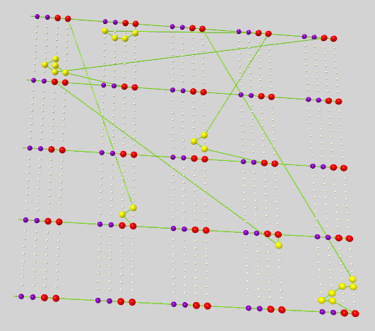

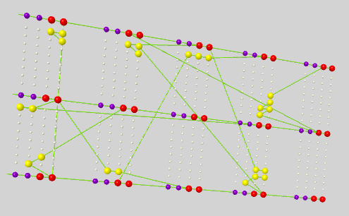

== Chapitre 2 : EDO/EDP et l'épidémiologie

Les modèles mathématiques de maladies infectieuses ont commencé à être mis en pratique avec le problème du SIDA dans les années 1980. Ces modèles se basent sur le même rincipe :  on divise la population en classes épidémiologiques tels que les individus susceptibles d'être infectés, ceux qui sont infectieux, et ceux qui ont acquis une immunité à la suite de la guérison. Cette approche est utilisée non seulement   pour modéliser de très nombreuses maladies, mais aussi dans l'étude de la science des réseaux.

=== Modèle SI

Notre premier example est le modèle SI : susceptible, infected - est un modèle très simple, qui permet de modèliser la propagation de la varicelle et d'autres maladies qui peuvent être coupées par vaccination. 

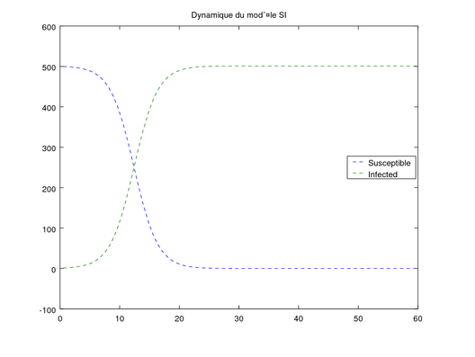

On a fait une simulation du modèle SI en mathis. On a utilisé les marches auto-évitantes sur un arbre, générées par l'algorithme statique "Biased Sampling". 

video::SI.mp4[]

== Modèle SIR

L'objet principal de cette étude est le modèle SIR : susceptible, infected, recovered - un autre modèle assez  simple, à partir duquel on dérive des modèles plus complexes. SIR permet de modèliser la propagation de la rougele ou parotidite virale. De plus, on supose le cas sans dynamique vitale, c.à.d personne n'est ni née, ni décédée.

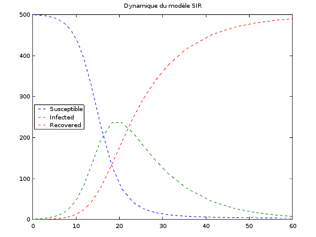

=== ODEs

Problème initial:

* stem:[S'= \gamma R - \alpha IS] 
* stem:[I'= \alpha IS - \beta I]
* stem:[R'= \beta I - \gamma R] 

where stem:[S+I+R=1]

Et si l'immunauté n'est pas permanent? (la grippe)

Stochastique SIR: on fait le choix aléatoire entre S,I,R:

* Si on choisi S, donc on le change pour I avec la probabilité stem:[ \frac{\alpha NI(t)}{N-1}]
* Si on choisi I, donc on le change pour R avec la probabilité stem:[\beta]
* Si on choisi R, donc on le change pour S avec la probabilité stem:[\gamma]

Sous les hypothèses:

* stem:[A(\Delta t) \approx A_0 \Delta t]
* stem:[B(\Delta t) \approx B_0 \Delta t]
* stem:[C(\Delta t) \approx C_0 \Delta t]

On obtient la discretization Euler du problème initial:

* stem:[S(t+\Delta t)=S(t)(1-A(\Delta t)I(t))+R(t)C(\Delta t)]
* stem:[I(t+\Delta t)=I(t)(1-B(\Delta t))+A(\Delta t) I(t) S(t)]
* stem:[R(t+\Delta t)=R(t)(1-C(\Delta t))+B(\Delta t)I(t)]

==== Dérivation de EDP hyperbolique de Kolmogorov pour un modèle stochastique discrèt:

Supposons stem:[P_{N, \Delta t} (t,n,m)] - la probabilité au moment stem:[t] d'avoir stem:[n] personnes susceptibles, stem:[m] personnes infectées et stem:[N-n-m] personnes immunisées dans population constante stem:[N].

Les constantes stem:[\alpha, \beta, \gamma] au limite 

stem:[P_{N, \Delta t} (t+\Delta t,n,m) = \alpha \frac{(n+1)(m-1)}{N(N-1)} P_{N, \Delta t}(t,n+1,m-1)] 
stem:[ + \beta \frac{m+1}{N} P_{N, \Delta t} (t,n,m+1) + \gamma \frac{N-n-m+1}{N}P_{N, \Delta t}(t,n-1,m) ] 
stem:[ + (\frac{n}{N} (1-\alpha \frac{m}{N-1}) +\frac{m}{N}(1-\beta) + \frac {N-n-m}{N}(1-\gamma)  ) P_{N, \Delta t}(t,n,m)]

Maintenant, on pose stem:[x=n/N], stem:[y=m/N] et stem:[p(t,x,y)=NP_{N, \Delta t}(t,xN,yN)].

stem:[t+\Delta t,x,y)= \alpha \frac{(x+1/N)(y-1/N)}{1-1/N} p(t,x+1/N,y-1/N)]
stem:[+ \beta (y+\frac{1}{N}) p(t,x,y+1/N) + \gamma (1-x-y+\frac{1}{N}) p(t,x-1/N,y)] 
stem:[ + (x(1-\frac{\alpha y}{1-1/N}) +y(1-\beta)+(1-x-y)(1-\gamma)  p(t,x,y)]
stem:[ \approx p+\frac{1}{N} (\partial_x ((\alpha xy - \gamma(1-x-y))p) +\partial_y((\beta-\alpha x)yp) ]

Enfin, on obtient EDP hyperbolique de Kolmogorov stem:[\partial_t p = \partial_x ((axy-c(1-x-y))p)+\partial_y ((b-ax)yp) ] avec la probabilité
stem:[ \frac{d}{dt} \int_S p(t,x,y)dxdy=0] où S est un triangle.

Dans le cas où on suppose qu'on sait la proportion exacte de stem:[S,I] et stem:[ R] au moment stem:[t], donc on peut trouver la solution pour tout stem:[t].  Dans notre cas, on ne sait que la loi de  = probabilité, donc l'équation de Kolmogorov transport cette probabilité dans le temps.

== La méthode des caractéristiques

La méthode des caractéristiques est une technique permettant de résoudre les équations aux dérivées partielles. Particulièrement adaptée aux problèmes de transport, elle est utilisée dans de nombreux domaines tels que la mécanique des fluides ou le transport de particules. 

Pour une équation aux dérivées partielles du premier ordre, la méthode des caractéristiques cherche des courbes  « caractéristiques » le long desquelles l'équation aux dérivées partielles se réduit à une simple équation différentielle ordinaire. La résolution de l'équation différentielle ordinaire le long d'une caractéristique permet de retrouver la solution du problème original.

==== SIR comme EDP de transport

**x** = (x,y) , stem:[\Phi_t(\textbf{x})]
* X =c(1-X-Y)-stem:[\alpha] XY
* Y =(aX-b)Y

Let stem:[p_0(\textbf{x}) \in C^1 (R^2)]
stem:[ F * \nabla Q = - \nabla * F ] (F is rhs)

stem:[p(t,x,y) = e^{Q(\textbf x)-Q(\Phi_{-t}(\textbf{x}))}p_0(\Phi_{-t}(\textbf{x}))] avec stem:[\textbf{x}=(x,y)].

stem:[e^{-Q(\phi_t( \textbf{x}_0))}p(t,\phi_t(\textbf{x}_0)) =e^{Q(\textbf{x}_0)} p_0(\textbf{x}_0) ]

Donc au final:

stem:[0=e^{Q(\phi_t (x_0))} \frac{d}{dt} e^{-Q(\phi_t(\textbf{x}_0))}p(t,\phi_t(\textbf{x}_0))= ]
stem:[=-F(\phi_t(\textbf{x}_0))*\nabla Q (\phi_t(\textbf{x}_0))p(t,\phi_t(\textbf{x}_0))+\partial_t p(t,\phi_t (\textbf{x}_0))+F(\phi_t(\textbf{x}_0)) \nabla p(t,\phi_t(\textbf{x}_0))]
stem:[=\nabla * Fp+ F\nabla p+ \partial_t p]
stem:[=\partial_t p + \nabla *(pF)]

Les equations du modèle SIR  forment les caractéristiques pour l'EDP hyperbolique de Kolmogorov et la densité de la probabilité sera transporté le long de ces caractéristiques.

== Gantt

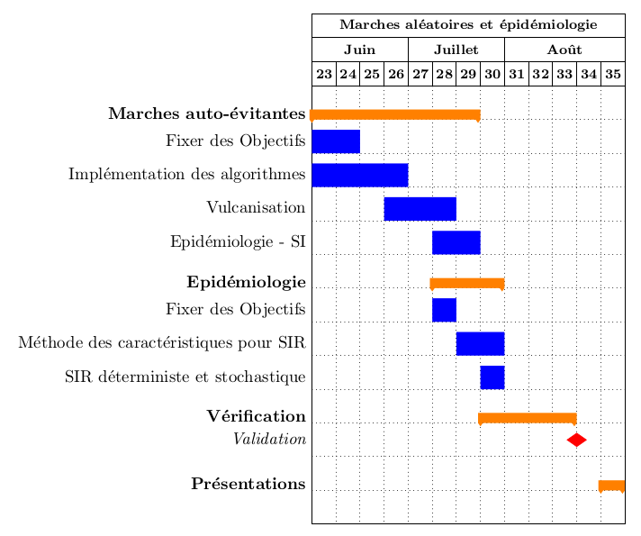

|====
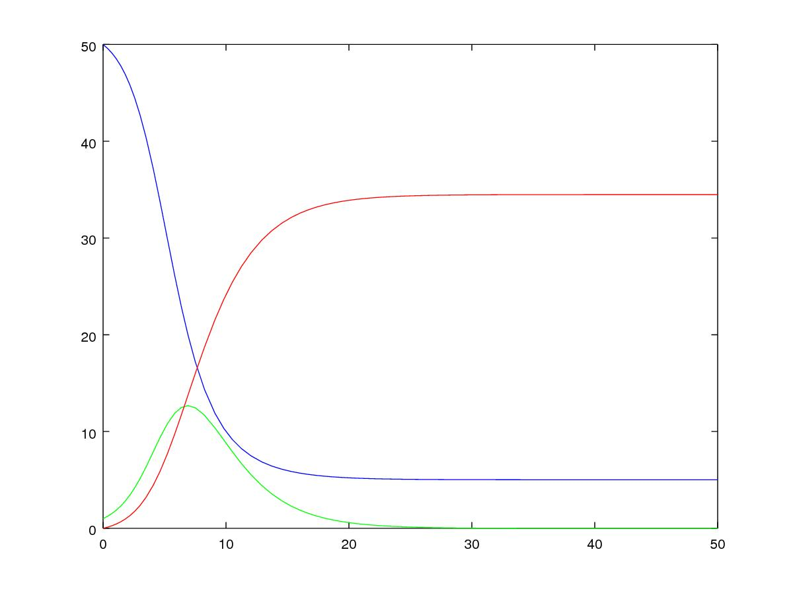 | 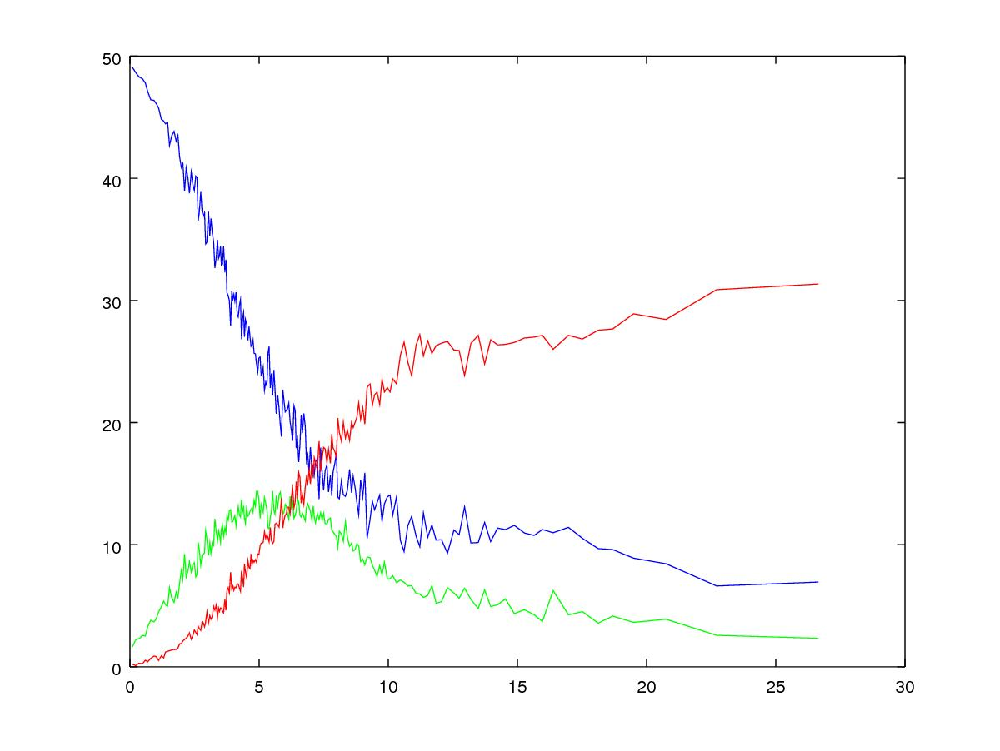
|====

|====
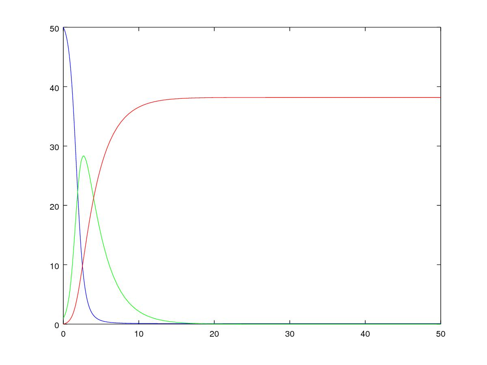 | 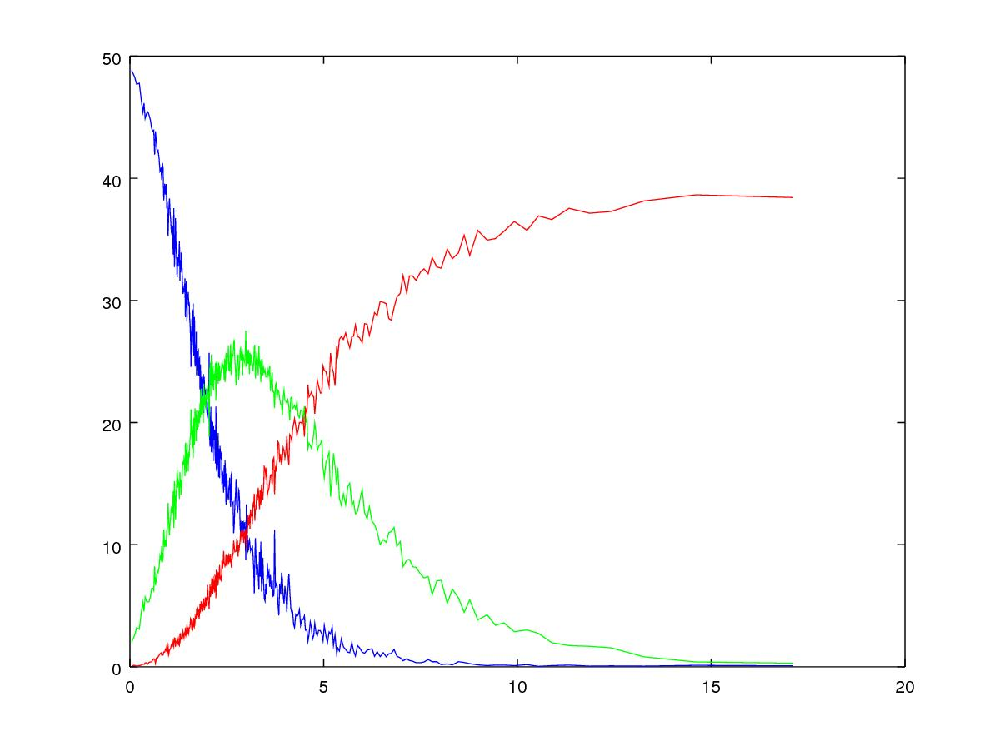
|====

|====
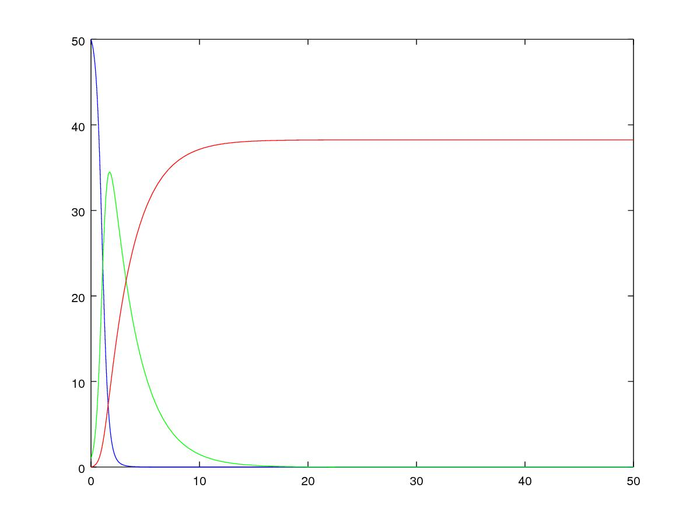 | 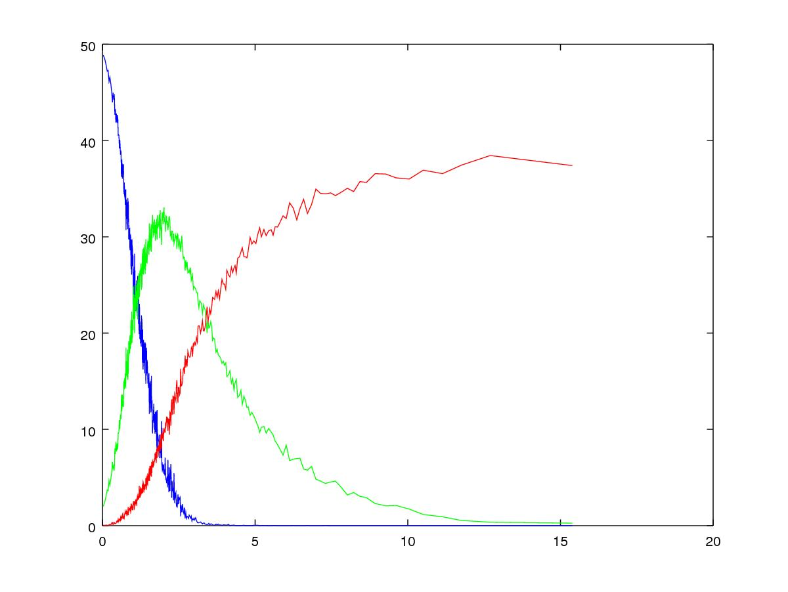
|====

|====
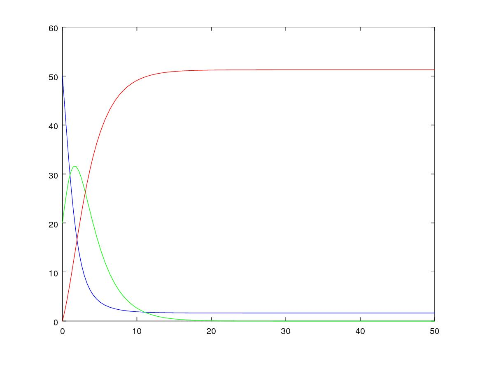 | 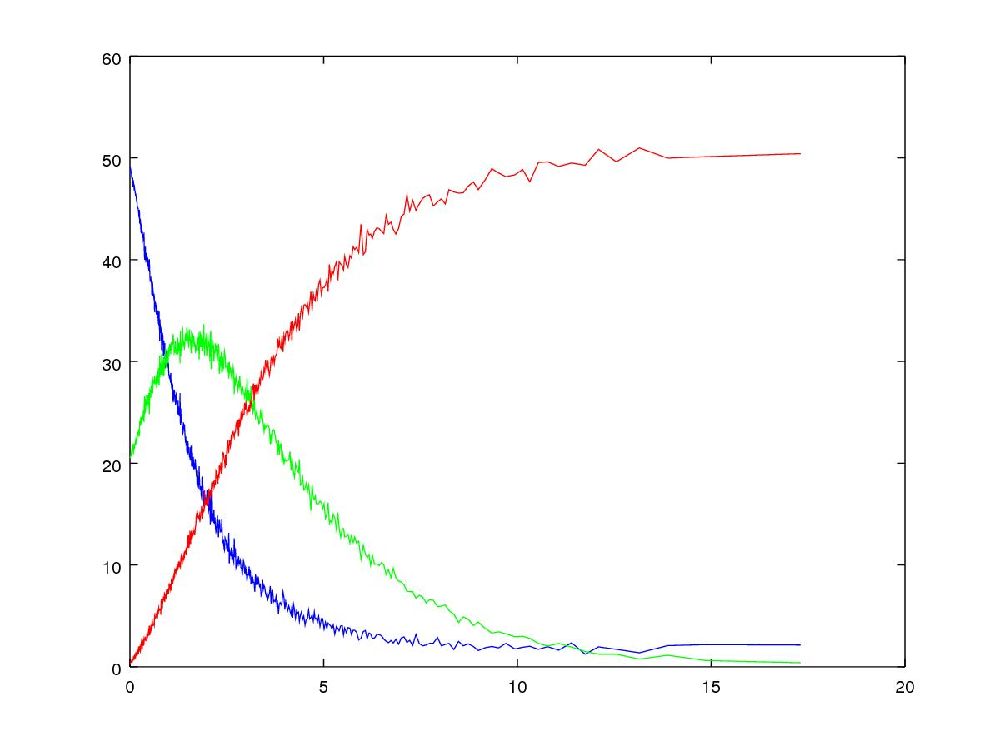
|====

|====
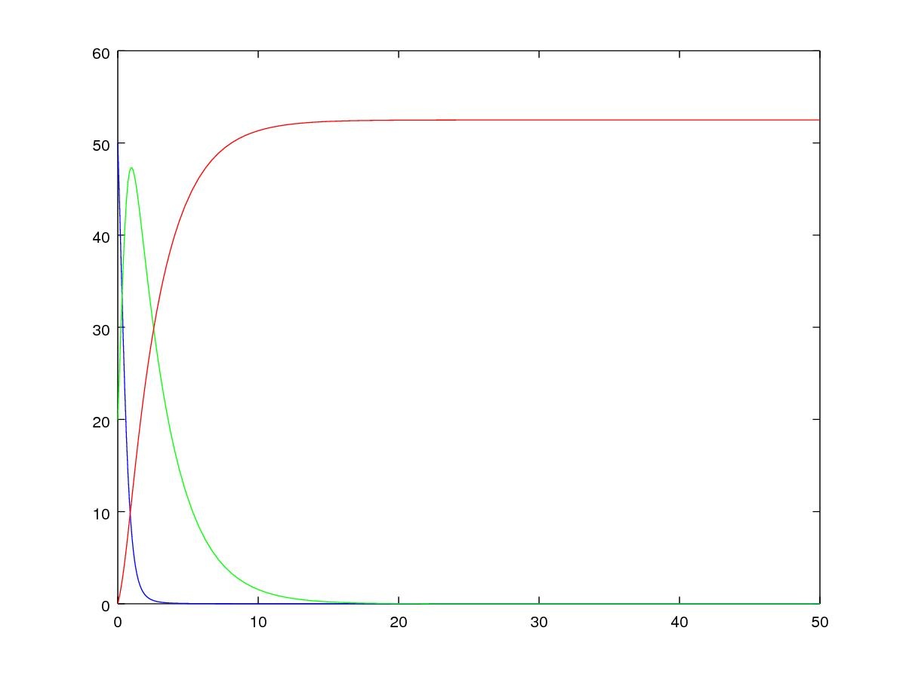 | 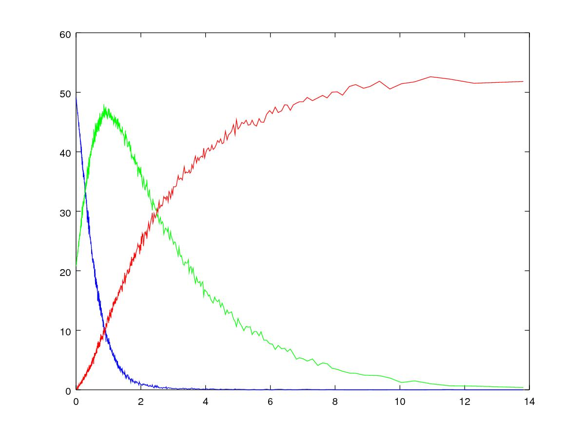
|====

|====
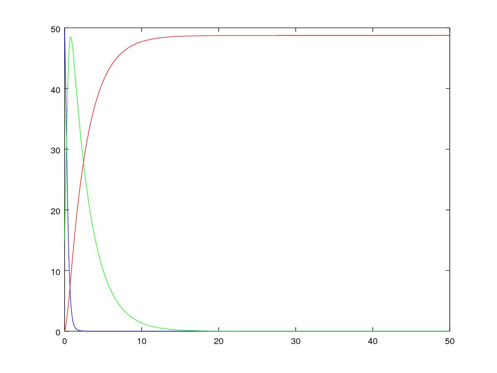 | 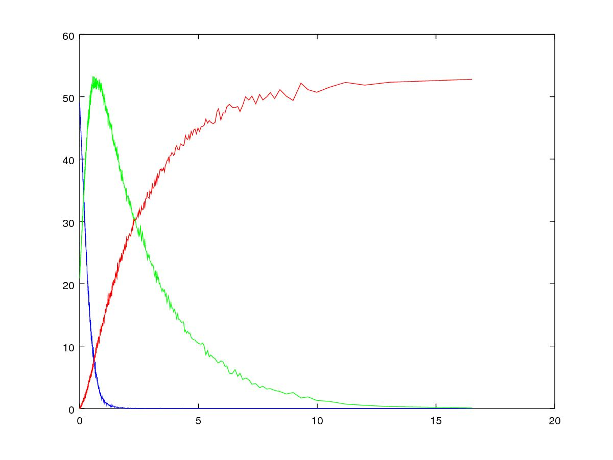
|====

